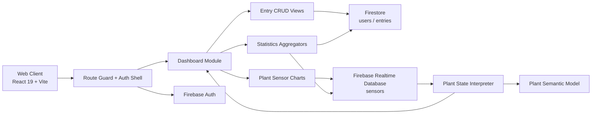

# BioNeo Web

Plant health telemetry and commercial operations dashboard built with React 19 and Firebase.

    

## Visual Preview & Architecture Summary

BioNeo Web is a data-centric operational dashboard for monitoring plant conditions and reconciling transactional activity in a single user-scoped workspace. The application combines real-time sensor ingestion from Firebase Realtime Database, structured transactional records in Firestore, and a modular React interface that separates presentation logic from domain interpretation and analytics.

## Key Engineering Highlights

- Domain-driven state modeling: plant condition data is normalized through a dedicated interpretation layer before it reaches the UI, keeping sensor ingestion, simulation, and rendering decoupled.
- Split data responsibilities: authentication and user identity flow through Firebase Auth, while operational records and user metadata are persisted in Firestore, maintaining clear ownership boundaries.
- Real-time analytics pipeline: sensor snapshots are consumed via Firebase listeners, transformed into chart-ready datasets, and rendered without duplicating server-side business logic in the frontend.
- Ledger-oriented operations model: sales and purchase entries are aggregated over configurable periods to produce balance, trend, and summary views with deterministic reporting logic.
- Route-aware application shell: protected routing and session restoration enforce user-scoped access patterns while keeping the dashboard shell reusable across authenticated flows.

## Tech Stack Breakdown

| Category | Technologies |
| --- | --- |
| Frontend / UI | React 19, Vite, React Router DOM, Framer Motion, Chart.js, react-chartjs-2, Tailwind CSS |
| Backend & APIs | Firebase Authentication, Firestore, Realtime Database, Firebase SDK |
| Data & Persistence | Firestore collections for users and entries, Realtime Database for sensor streams |
| Architecture & Tooling | Modular component layering, environment-driven configuration, ESLint, Vite plugin ecosystem |

## System Architecture / Data Flow



The system is intentionally organized around explicit boundaries: user identity and access control are managed by Firebase Auth, business records and analytics are persisted in Firestore, and sensor telemetry is consumed through a dedicated realtime stream. The plant interpretation layer exists between raw sensor inputs and UI semantics, which reduces coupling and makes the app easier to test and evolve.

## Project Structure

```text
BioNeo-web/
├── public/
├── src/
│   ├── assets/
│   ├── components/
│   │   ├── BioDemo/
│   │   │   ├── Char/
│   │   │   ├── Controller/
│   │   │   ├── Effects/
│   │   │   ├── FirebaseControllers/
│   │   │   ├── Motion/
│   │   │   ├── Plant/
│   │   │   ├── State/
│   │   │   ├── Background.jsx
│   │   │   ├── BioDemo.jsx
│   │   │   ├── Buttons.jsx
│   │   │   └── UIOverlay.jsx
│   │   ├── dashboard/
│   │   │   ├── buttons/
│   │   │   ├── inputs/
│   │   │   ├── mainBoard/
│   │   │   ├── BarLeft.jsx
│   │   │   ├── Dashboard.jsx
│   │   │   ├── EntryModal.jsx
│   │   │   ├── ViewEntryModal.jsx
│   │   │   └── ...
│   │   ├── logIn/
│   │   └── Modal.jsx
│   ├── App.css
│   ├── App.jsx
│   ├── index.css
│   └── main.jsx
├── .env.example
├── eslint.config.js
├── firebaseConfig.js
├── index.html
├── package.json
├── vite.config.js
├── README.md
```

## Local Development Setup

### Prerequisites

- Node.js 20 LTS or newer
- npm 10.x or newer
- Git

### 1) Clone the repository

```bash
git clone https://github.com/<your-username>/BioNeo-web.git
cd BioNeo-web
```

### 2) Install dependencies

```bash
npm install
```

### 3) Configure environment variables

Create a local environment file from the project template:

```bash
cp .env.example .env
```

Then populate the variables with your Firebase project configuration:

```env
VITE_FIREBASE_API_KEY=your_api_key
VITE_FIREBASE_AUTH_DOMAIN=your_project.firebaseapp.com
VITE_FIREBASE_DATABASE_URL=https://your_project-default-rtdb.firebaseio.com
VITE_FIREBASE_PROJECT_ID=your_project
VITE_FIREBASE_STORAGE_BUCKET=your_project.appspot.com
VITE_FIREBASE_MESSAGING_SENDER_ID=your_messaging_sender_id
VITE_FIREBASE_APP_ID=your_app_id
VITE_FIREBASE_MEASUREMENT_ID=your_measurement_id
```

### 4) Run the application

```bash
npm run dev
```

The app starts on the default Vite development server, usually at:

```text
http://localhost:5173
```

### 5) Production build

```bash
npm run build
npm run preview
```

### 6) Linting

```bash
npm run lint
```

## Summary

BioNeo Web is a compact but technically structured application that sits at the intersection of plant-state intelligence, realtime telemetry, and operational reporting. Its architecture emphasizes modular boundaries and data ownership, which makes it a suitable example of a front-end system designed around clean domain separation and service-backed persistence rather than ad hoc UI logic.
